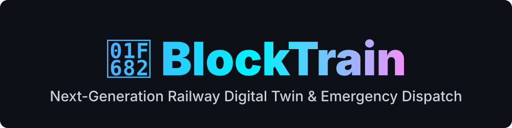



  
  
  <h1>🚂 BLOCKTRAIN</h1>
  
<b>AI-Driven Zero-Conflict Shadow Block Maintenance Optimizer for Indian Railways</b>

  
  
  
  
  
  
   

## 📖 Overview
**BlockTrain** is a production-ready, highly secure platform designed to solve the *Problem Statement 26027* for the Indian Railways. It leverages a two-stage Machine Learning (XGBoost) and Mathematical Optimization (MILP) pipeline to dynamically aggregate scattered maintenance requests into efficient **"Shadow Blocks"**—dramatically reducing train detention times and increasing maintenance windows.

## 🚀 Key Innovations
1. **Dynamic Shadow Clustering:** Identifies overlapping maintenance tasks within a $\Delta2.5km$ radius.
2. **AI Urgency Prioritizer:** Uses a 39-variable GBDT tensor to accurately score defect urgency with 93.21% accuracy.
3. **Automated Legal Compliance:** Auto-generates standard *T/409 Caution Order Memos* digitally.
4. **Zero-Trust Security:** Completely isolated inside an AWS Virtual Private Cloud (VPC), armed with strict DDoS and Brute-Force protections.

## 🏗️ Enterprise Hybrid-Cloud Architecture

This prototype utilizes a scalable, zero-trust cloud architecture:
*   **Edge Frontend:** Vercel Global CDN (Next.js 14, Zustand, Tailwind)
*   **Compute Hub:** AWS EC2 	3.micro (Dockerized Node.js API + Python ML Engine)
*   **Secure Data Layer:** AWS RDS (Managed PostgreSQL)
*   **Secrets Manager:** AWS Systems Manager (SSM) Parameter Store

## 📁 Repository Structure
\\\	ext
📦 BlockTrain
 ┣ 📂 apps/api                 # Node.js Express REST API (Dockerized)
 ┣ 📂 frontend                 # Next.js 14 Web Dashboard (Vercel)
 ┣ 📂 model_implementation     # Python Machine Learning Pipeline (Dockerized)
 ┣ 📂 docs                     # Deep Technical Context & Slide Decks
 ┃ ┣ 📂 presentations          # SIH Hackathon PPTX files
 ┃ ┗ 📜 BLOCKTRAIN_MASTER_PROJECT_CONTEXT.md  # The Core Blueprint
 ┗ 📜 docker-compose.yml       # AWS Enterprise Deployment Orchestrator
\\\

## 🛠️ Local Development
To spin up the entire architecture locally:
\\\ash
git clone https://github.com/kevinjosh10/Block-Train.git
cd Block-Train
docker-compose up -d --build
\\\

  
  
<i>Built for the SIH Hackathon — Securing the Future of Indian Railways</i>

